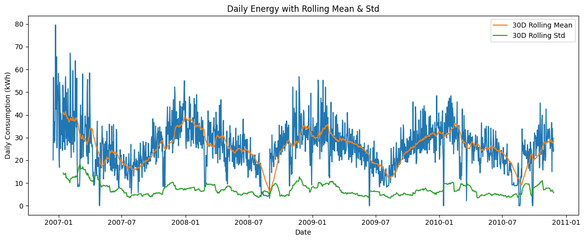
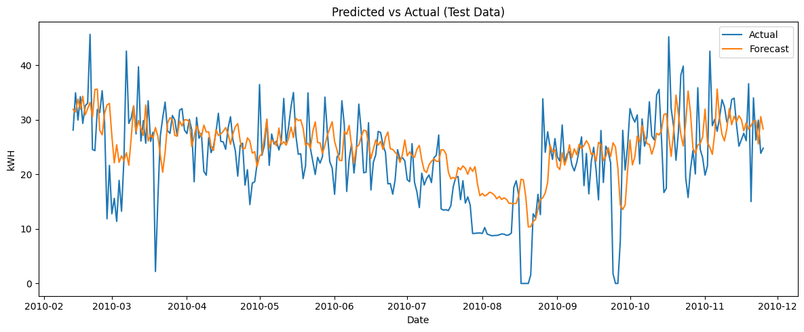

# Energy Consumption Forecasting

Forecasting daily household energy consumption using time-series models.

## Reproduction instructions
1. Download the dataset from the UCI machine learning repository [here[(https://archive.ics.uci.edu/dataset/235/individual+household+electric+power+consumption).
2. Place `household_energy_consumption.txt` in the `data/` directory
3. Run `modeling_and_forecasting.ipynb` and `analysis.ipynb`

## Dataset
UCI Individual Household Electric Power Consumption Dataset.

## Methods
- Daily aggregation
- Autoregressive lag features
- Baseline models (naive, seasonal naive)
- Residual diagnostics and evaluation (MAE, RMSE)

## Files
- `analysis.ipynb`: EDA and feature engineering
- `modeling_and_forecasting.ipynb`: Modeling, evaluation, and diagnostics
- `aggregate_data.ipynb`: Helper module to preprocess data

## Limitations and Next Steps
- No weather/calendar exogenous variables included
- Linear models struggle with extreme usage spikes
- Future work: incorporate calendar effects more, include appliance sub-metering, evaluate other nonlinear models and probabilistic forecasts

## Key Plots
### Daily energy consumption (kWh)

### Autocorrelation (ACF) of daily consumption

### Forecast vs actual (test set)

## Tools
- Python
- pandas, numPy
- statsmodels
- matplotlib
